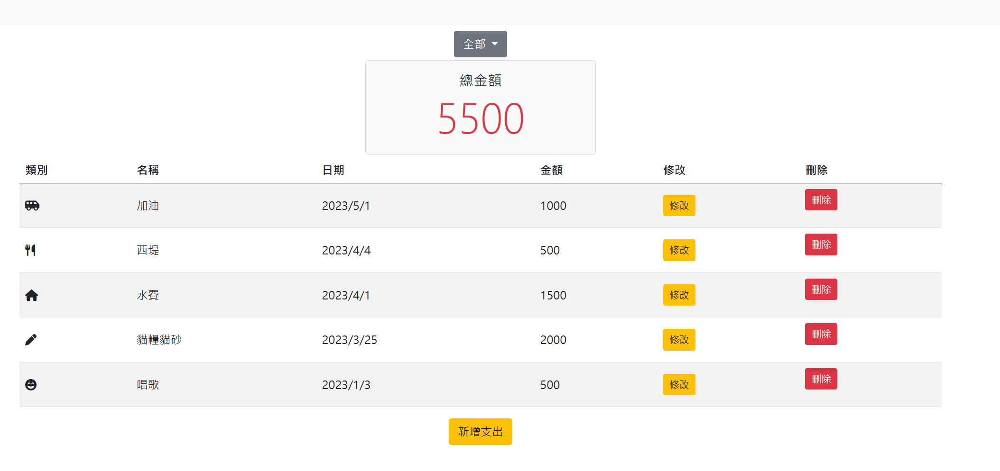

#爸爸的私房錢


##一個簡易的記帳網站、介面簡潔風格

##Features 產品功能

- 使用者可以註冊帳號
- 使用者可以登陸、建立自己的記帳資料
- 使用者可以新增、修改、查閱、刪除資料
- 使用者可以看到支出總額，也可以依類別查閱總額與項目

##使用

1. 將專案 clone 到本地 2.進入專案資料夾
2. 使用終端機進入該資料夾並初始化

```
npm init -y
```

3. 下載專案所需套件

```
npm install
```

4. 設定環境變數
5. 載入種子資料

```
npm run seed
```

6. 啟動伺服器

```
npm run dev
```

7. 看見此行訊息代表運行成功，並順利連接資料庫

```
Server is running on http://localhost:3000
mongodb connected!
```

##Environment Set up

- Node.js@18.16.0
